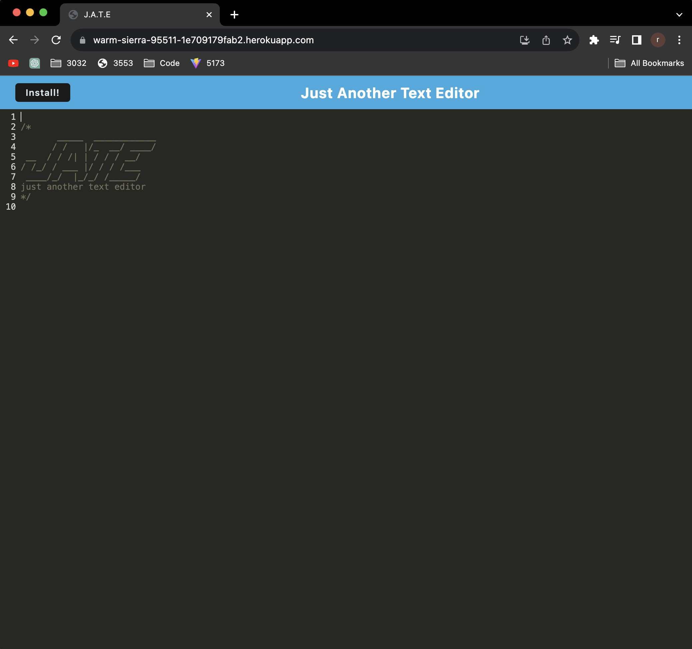
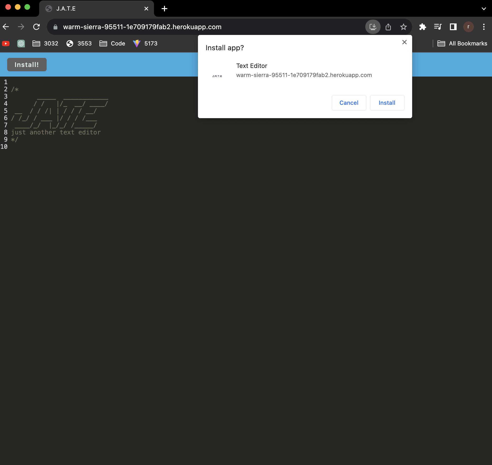
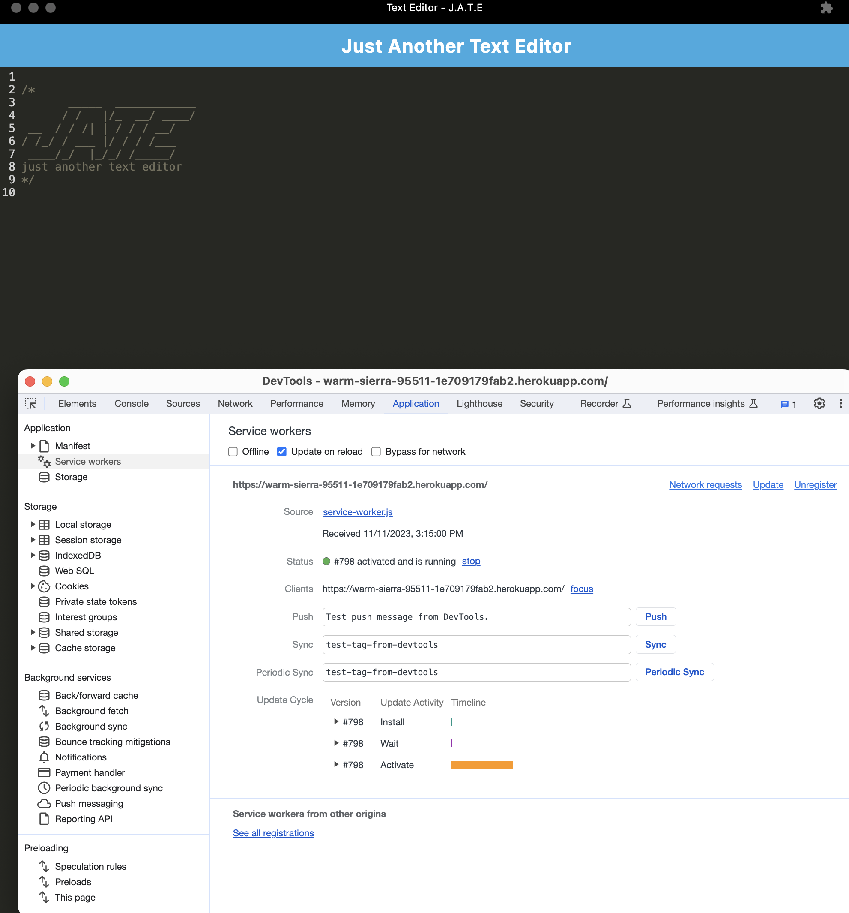
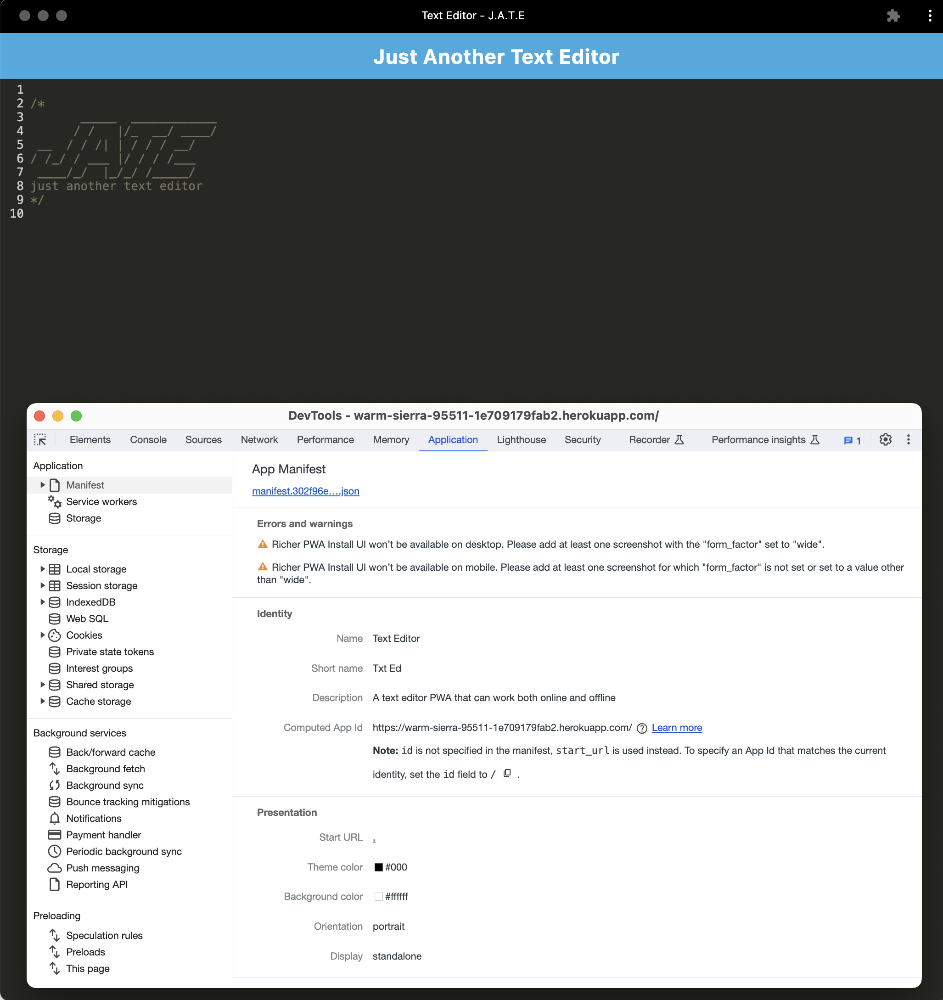
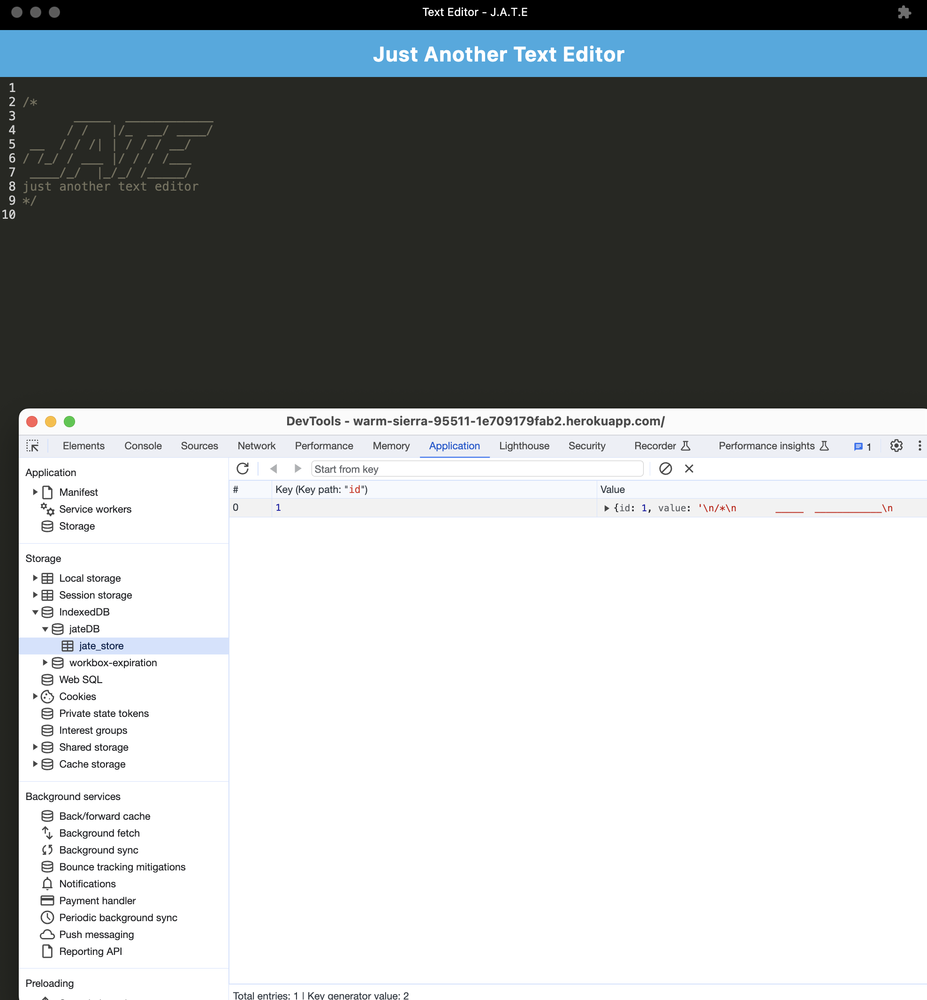

# PWA[License: MIT)](https://img.shields.io/badge/License-MIT-yellow.svg)

## Description

The goal of this project is to build a text editor that runs in the browser and can be downloaded as a PWA (progressive web app). The application should also function offline. The database that is being used is a package that can be downloaded called 'IDB' or IndexedDB database - the site will be deployed on Heroku upon deployment

> ### What was your motivation?
>
> Learning how to create a PWA app with the use of IndexDB. This is to see the ability of getting an app to work even if it is offline.

> ### Why did you build this project?
>
> The point of doing this project is to be able to create apps that even work offline for future clients.

> ### What problem does it solve?
>
> It allows the user to continue using their web app even during offline

> ### What did you learn?
>
> Learned how to use webpack to create a PWA

## Table of Contents

- [Installation](#installation)
- [Usage](#usage)
- [License](#license)
- [Contributing](#contributing)
- [Tests](#tests)

## Installation

npm install
npm run build
npm start

## Usage

    

## License

MIT License Info.

## Badges

## Contributing

No one at the moment.

## Tests

Rodolfo Espinosa Nunez

## Questions for me?

Shoot me an email to rodolfoespinosa01@gmail.com

## Github Profile

Visit my Github profile!
https://github.com/rodolfoespinosa01

## Project Repo

https://github.com/rodolfoespinosa01/bc_c19_pwa

## Heroku Deployed App

https://warm-sierra-95511-1e709179fab2.herokuapp.com/
